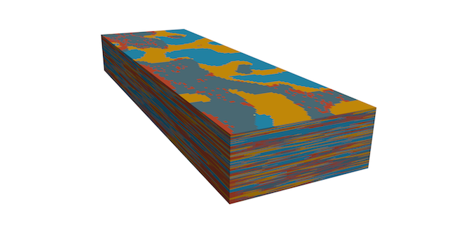
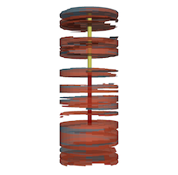
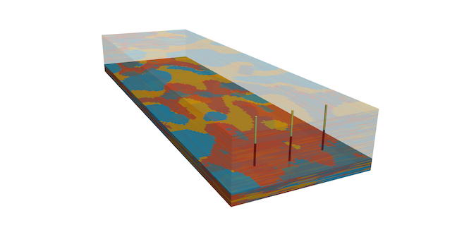
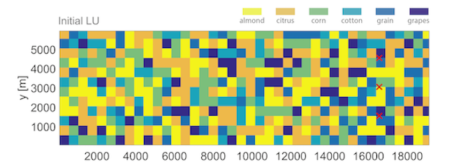
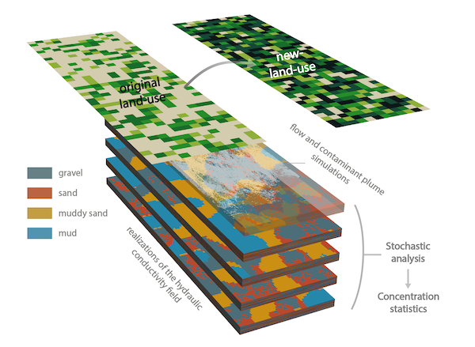

 
 
 
### Authors
[Christopher V. Henri](https://gwt.sf.ucdavis.edu/people/chris-henri)  
[Thomas Harter](https://gwt.sf.ucdavis.edu/people/thomas-harter)  
Department of Land, Air and Water Resources  
Umiversity of California, Davis
 
 

# Tools Conceptual Background
This tool allow a quick visualization of main management metrics and of the impact of land-use change (LUC) on contaminant level predicted in extraction wells for a typical nitrate contamination in the Central Valley (CA, USA).
It does not intent to reproduce an actual contamination, but provides global understanding on the potential dynamic of different useful metrics and allows to assess time-scales of contamination propagation and of eventual management actions.

For extensive information on the conceptual and mathematical background of this study, please see the associated [peer-reviewed articles](https://gwt.sf.ucdavis.edu/publication-or-reference/stochastic-assessment-land-use-change-effect-groundwater-quality).

   

## The Region and Aquifer

We consider here a non-consolidated sedimentary aquifer typical of the Central Valley (California, USA), initially clean (e.g., pre-development state) and contaminated by nitrate of agricultural origin.

### Stochastic approach

Uncertainty in the representation of the spatial variability of the aquifer hydraulic conductivity is systematically accounted for through the use of a geostastical model in a Monte Carlo framework (using the sofware [TPROGS](http://gmsdocs.aquaveo.com/t-progs.pdf)). The propagation of uncertainty to a series of management metrics recorded at a series of extraction wells is then assessed.

Two interpretations can given to this stochastic analysis. First, the generated large number of realizations of individual wells may represent the uncertainty on the representation of the spatial variability of aquifer hydraulic properties around any specific well location, for example, when considering contamination at a specific well. On the other hand, it can also be interpreted as the variability of hydraulic conditions across many different well locations, where contaminant measurements have been made and where the aquifer is characterized by geostatistically similar geological features.

Therefore, results of contaminant transport to wells can be interpreted as either probabilistically representing future outcomes at a particular well; or as representing the actual range of outcomes that would likely be observed in a large set of wells subject to comparable conditions. This second interpretation of the analysis would, therefore, provide statistical summary of likely observation of management metrics in a large set of wells of a specific region. The latter is useful for regulatory activity across multiple landowners to, for example, establish long-term impacts on large sets of wells in a region from a permit action affecting many landowners.

### Production Well Design

For each realization of the hydraulic conductivity field, 3 extraction wells are implemented. The pumping rate of each well is fixed to 3000 m^3/d and the top of the screen is fixed to 50, 100 or 150 m (user defined). As in real settings, the length of this screen is dependent on the local aquifer properties in order to sustain the total extraction rate. Indeed, pumping effectively occurs through portions of well located in highly conductive aquifer material. To simulate this local K dependence of the well screen length, we are using a rule of thumb stating that 10 cumulative foot (3.05 m) of gravel and sand has to be crossed for each 100 gallon-per-minute (545.1 m^(3)/d) of extraction.

   
## The Non-Point Source Contamination

### Soil Map
The top layer of the geostatistically generated K-field is here considered to represent the spatial variability observed in the soil type. This way, a soil map, displaying the spatial distribution of the 4 hydrofacies (gravel, sand, muddy sand, mud), is associated to each realization of the K-field.

### Land-Use
The modeled basin is considered to be exclusively allocated to agricultural activities. Six different crop types are randomly distributed over the domain. The crops are: almond, citrus, corn, cotton, grain and grapes.

In the simulations used for the "Concentration Statistics" page, all fields have a similar dimension of 360 m x 300 m. The spatial distribution of the fields were generated randomly and fulfills the following proportions of the 6 crop types: 24% of Almond, 24% of Citrus, 18% of Corn, 12% of Cotton, 12% of Grain, 10% of Grapes.
For the "Land-Use Change" page, the land-use (in term of proportion of each crops in the basin and input -leaking- concentration) is specified by the user.

 

   
## The Flow and Transport Modeling

The "Concentration Statistics" are computed from the numerical simulation of groundwater flow and nitrate transport. This section provide a short description of the modeling framework. For detailed information, please see the linked references.

### Non-saturated zone
The input concentrations of nitrate and rate of infiltrated water (effective recharge) reaching the groundwater table are evaluated from a series of [Hydrus 1D](https://www.pc-progress.com/en/Default.aspx?hydrus-1d) simulations.

### Saturated flow
The groundwater flow is described by the Darcy Law and is solved numerically by means of the software [Modflow 2000](https://www.usgs.gov/mission-areas/water-resources/science/modflow-and-related-programs).
We set up modeling conditions reproducing the downward flux due to intensive extractions of water in the area. Recharge rate is spatially variable, and dependent on the local crop and soil material.

### Transport
Once the flow is solved, we can simulate the motion of nitrate in the aquifer following a constant leaking of contaminant.
Transport is solved using the code RW3D, a particle tracking algorithm.
A large number of particles (half a million) is injected in a fashion modeling the spatially variable leaking of nitrate from crops.  

   
## Land-use change assessment

The proposed tool allow the visualization of the impact on well concentration statistics (percentiles) of a potential land-use change (proportion of crops in a basin, and nitrate mass flux infiltrating into the groundwater). The analytical solution used here has been tested, and is using the concentration percentiles previously estimated from full flow and transport stochastic simulations. A simple scaling approach is then adapted to estimate the consequences of a land use change on contaminant levels.

Previous tests have shown that an important modification in the averaged recharge rate would lead to significantly different transport features. Thus, such scenarios cannot be assessed analytically. The method only allows for a change in (1) the crop proportions over the basin which does not lead to a significantly changed averaged recharge rate, and (2) the crop dependent leaking nitrate mass flux (averaged over the different soil types), which does not impact the flow field and nitrate transport paths.

 

   

